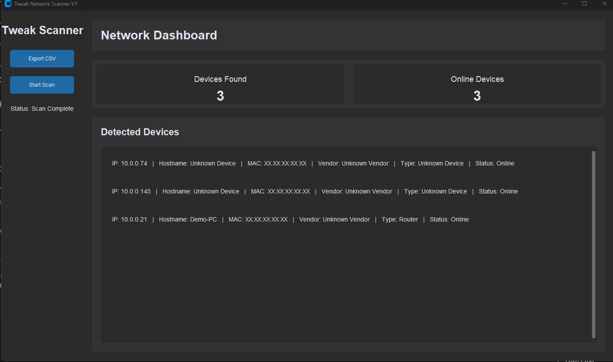

# Tweak Network Scanner

A Python GUI cybersecurity tool for scanning and mapping local network devices.

---

## Screenshot



---

## Features

- Local network scanning
- Automatic network range detection
- IP address detection
- Hostname lookup
- MAC address detection
- Device type detection
- CSV export support
- Privacy-safe demo mode
- Dark themed dashboard UI
- Threaded scanning system

---

## Demo Mode

This project includes a safe demo mode for screenshots, tutorials, and YouTube videos.

Demo mode masks:

- MAC addresses
- Vendor names
- Sensitive local identifiers

---

## Requirements

- Python 3.11+
- Windows recommended

---

## Installation

Clone the repository:

```bash
git clone https://github.com/TweakCodeYT/tweak-network-scanner.git
```

Go into the project folder:

```bash
cd tweak-network-scanner
```

Create virtual environment:

```bash
python -m venv venv
```

Activate virtual environment:

### Windows

```bash
venv\Scripts\activate
```

Install dependencies:

```bash
pip install -r requirements.txt
```

Run the scanner:

```bash
python src/main.py
```

---

## Project Structure

```text
tweak-network-scanner/
│
├── assets/
│   └── screenshots/
│
├── data/
├── exports/
├── logs/
│
├── src/
│   ├── main.py
│   ├── scanner.py
│   ├── ui.py
│   └── utils.py
│
├── requirements.txt
├── README.md
└── .gitignore
```

---

## Export Support

The scanner supports exporting detected devices to CSV format for:

- Documentation
- Asset inventory
- Network mapping
- Security auditing

---

## Privacy & Safety

This project is intended for:

- Educational purposes
- Local network auditing
- Home lab environments
- Authorized cybersecurity testing

Only scan networks you own or have permission to test.

---

## Future Plans

Planned upgrades include:

- Vendor lookup API
- Live device monitoring
- Port scanning
- Device fingerprinting
- Threat detection
- Network topology mapping
- Home defense dashboard integration

---

## License

This project is licensed under the MIT License.

---

## Author

Created by TweakCodeYT

GitHub:
https://github.com/TweakCodeYT